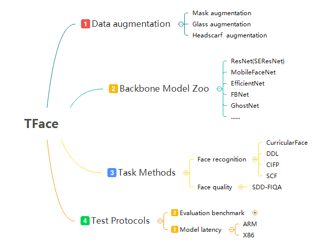

 

## Introduction

**TFace**: A trusty face recognition research platform developed by Tencent Youtu Lab. It provides a high-performance distributed training framework and releases our efficient methods implementation. This repo consists of four modules: 1. different data augmentation, 2. backbone model zoo, 3. our proposed methods for face recognition and face quality, 4. test protocols of evalution results and model latency.

 

## Recent News

**`2021.3`**: `SDD-FIQA: Unsupervised Face Image Quality Assessment with Similarity Distribution Distance` accepted by **CVPR2021** , details see [SDD-FIQA](https://github.com/Tencent/TFace/tree/quality)

**`2021.3`**: `Consistent Instance False Positive Improves Fairness in Face Recognition` accepted by **CVPR2021**, details see [CIFP](tasks/cifp/README.md)

**`2021.3`**: `Spherical Confidence Learning for Face Recognition` accepted by **CVPR2021**, details see [SCF](tasks/scf/README.md)

**`2020.8`**: `Improving Face Recognition from Hard Samples via Distribution Distillation Loss` accepted by **ECCV2020**, details see [DDL](tasks/ddl/README.md)

**`2020.3`**: `Curricularface: adaptive curriculum learning loss for deep face recognition` has been accepted by **CVPR2020**, details see [Curricularface](tasks/distfc/README.md)

## Requirements
* python==3.6.0
* torch==1.6.0
* torchvision==0.7.0
* tensorboard==2.4.0
* Pillow==5.0.0


## Getting Started

### Train Data

The training dataset is organized in tfrecord format for efficiency. The raw data of all face images is saved in tfrecord files, and every dataset has a corresponding index file(each line includes tfrecord_name, trecord_index offset, label). The `IndexTFRDataset` class will parse the index file to gather image data and label for training. This form of dataset is convenient for reorganization in data cleaning(do not reproduce tfrecord, just reproduce the index file).

1. Convert raw image to tfrecords, generate a new data dir including some tfrecord files and a index_map file
``` bash
python3 tools/img2tfrecord.py --img_list=${img_list} --pts_list=${pts_list} --tfrecords_name=${tfr_data_name}
```

2. Convert old index file(each line includes image path, label) to new index file
``` bash
python3 tools/convert_new_index.py --old=${old_index} --tfr_index=${tfr_index} --new=${new_index}
```

3. Decode the tfrecords to raw image
``` bash
python3 tools/decode.py --tfrecords_dir=${tfr_dir} --output_dir=${output_dir}
```

### Augmentation
Data Augmentation module implements some 2D-based methods to generated some hard samples, e.g., maks, glass, headscarf. Details see [Augmentation](torchkit/augmentation/README.md)


###  Train

Modified the `DATA_ROOT`and`INDEX_ROOT`in `./tasks/distfc/train_confing.yaml`, `DATA_ROOT` is the parent dir for tfrecord dir,  `INDEX_ROOT` is the parent dir for index file.


```bash
bash local_train.sh
```

### Test

Detail codes and steps see [Test](test/README.md)

## Benchmark

### Evaluation Results

|    Backbone    |      Head      |  Data  |  LFW  | CFP-FP | CPLFW | AGEDB | CALFW | IJBB (TPR@FAR=1e-4) | IJBC (TPR@FAR=1e-4) |
| :------------: | :------------: | :----: | :---: | :----: | :---: | :---: | :---: | :-----------------: | :-----------------: |
|     IR_101     |    ArcFace     | MS1Mv2 | 99.77 | 98.27  | 92.08 | 98.15 | 95.45 |        94.2         |        95.6         |
|     IR_101     | CurricularFace | MS1Mv2 | 99.80 | 98.36  | 93.13 | 98.37 | 96.05 |        94.86        |        96.15        |
|      IR_18      |    ArcFace     | MS1Mv2 | 99.65 | 94.89  | 89.80 | 97.23 | 95.60 |        90.06        |        92.39        |
|      IR_34      |    ArcFace     | MS1Mv2 | 99.80 | 97.27  | 91.75 | 98.07 | 95.97 |       92.88        | 94.65 |
|      IR_50      |    ArcFace     | MS1Mv2 | 99.80 | 97.63  | 92.50 | 97.92 | 96.05 |        93.45        |        95.16        |
| MobileFaceNet  |    ArcFace     | MS1Mv2 | 99.52 | 91.66  | 87.93 | 95.82 | 95.12 |        87.07        |        89.13        |
| GhostNet_x1.3  |    ArcFace     | MS1Mv2 | 99.65 | 94.20  | 89.87 | 96.95 | 95.58 |        89.61        |        91.96        |
| EfficientNetB0 |    ArcFace     | MS1Mv2 | 99.60 | 95.90  | 91.07 | 97.58 | 95.82 |        91.79        |        93.67        |
| EfficientNetB1 |    ArcFace     | MS1Mv2 | 99.60 | 96.39  | 91.75 | 97.65 | 95.73 |        92.43        |        94.43        |

### Backbone model size & latency

The device and platform information see below:

|         | Device                                        | Inference Framework |
| ------- | --------------------------------------------- | ------------------- |
| x86 cpu | Intel(R) Xeon(R) Platinum 8255C CPU @ 2.50GHz | [Openvino](https://docs.openvinotoolkit.org/latest/index.html)            |
| arm     | Kirin 980                                     | [TNN](https://github.com/Tencent/TNN)                 |

Test results for different backbones and different devices：

|    Backbone    | Model Size(fp32) | X86 CPU  |   ARM   |
| :------------: | :--------------: | :------: | :-----: |
| EfficientNetB0 |       16MB       | 26.29ms  | 32.09ms |
| EfficientNetB1 |       26MB       | 35.73ms  | 46.5ms  |
| MobileFaceNet  |      4.7MB       |  7.63ms  | 15.61ms |
| GhostNet_x1.3  |       16MB       | 25.70ms  | 27.58ms |
|     IR_18      |       92MB       | 57.34ms  | 94.58ms |
|     IR_34      |      131MB       | 105.58ms |   NA    |
|     IR_50      |      167MB       | 165.95ms |   NA    |
|     IR_101     |      249MB       | 215.47ms |   NA    |


## Acknowledgement
This repo is modified and adapted on these great repositories, we thank theses authors a lot for their greate efforts.
* [cavaface.pytorch](https://github.com/cavalleria/cavaface.pytorch)
* [face.evoLVe.PyTorch](https://github.com/ZhaoJ9014/face.evoLVe.PyTorch) 
* [insightface](https://github.com/deepinsight/insightface)
* [mobile-vision](https://github.com/facebookresearch/mobile-vision)

