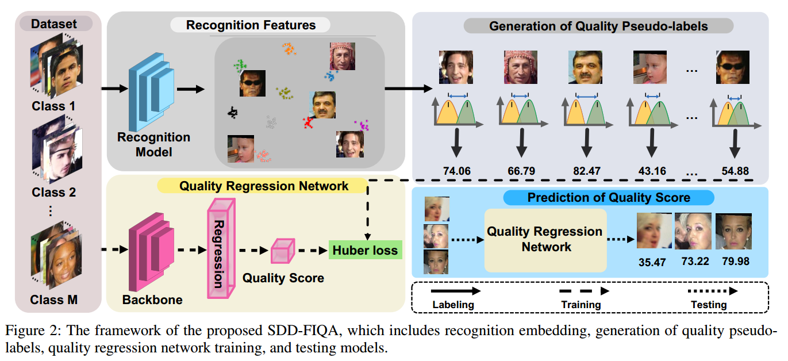
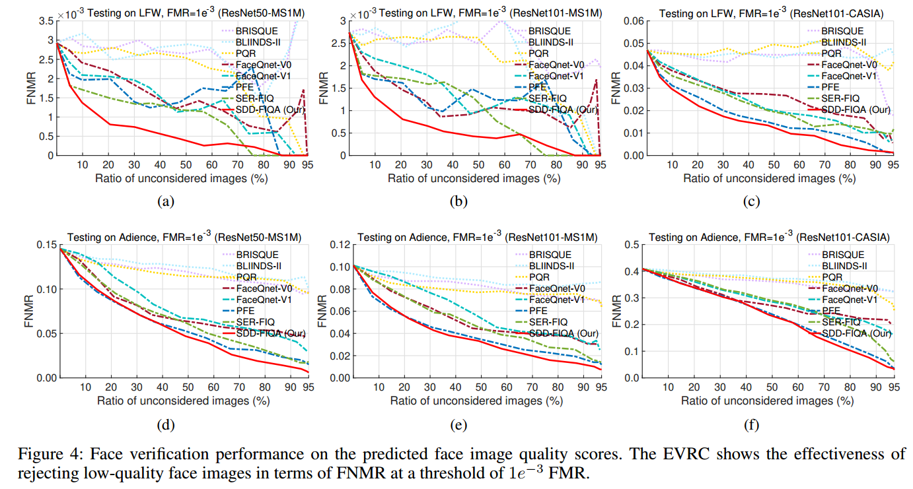
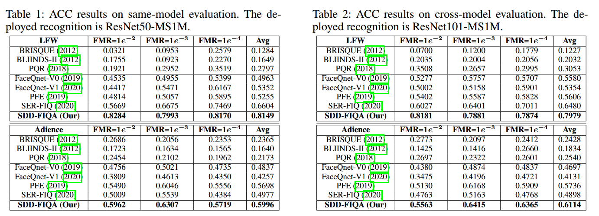

# SDD-FIQA: Unsupervised Face Image Quality Assessment with Similarity Distribution Distance

## Introduction
####
A high-quality face image should be similar to its intra-class samples and dissimilar to its inter-class samples. Thus, we propose a novel unsupervised FIQA method that incorporates Similarity Distribution Distance for Face Image Quality Assessment (SDD-FIQA). Our method generates quality pseudo-labels by calculating the Wasserstein Distance (WD) between the intra-class and inter-class similarity distri-butions. With these quality pseudo-labels, we are capable of training a regression network for quality prediction. Extensive experiments on benchmark datasets demonstrate that the proposed SDD-FIQA surpasses the state-of-the-arts by an impressive margin. Meanwhile, our method shows good generalization across different recognition systems.


## Requirements 
The pretrained basic face recognition model


## Generate quality pseudo label
2. Run './generate_pseudo_labels/gen_datalist.py' to generate pair list.
3. Run './generate_pseudo_labels/extract_embedding/extract_feats.py' to obtain recognition features.
4. Run './generate_pseudo_labels/gen_pseudo_labels.py' to calculate quality pseudo-labels.


## Local Training of  Quality Regression Model
1. Replace the data path with your loacl path on `train_confing.py`.
2. bash local_train.sh.

## Testing of Quality Regression Model 
Run './eval.py' to predict face quality score.
We provide the pretrained model on MS1MV2 with IR50： [googledrive](https://drive.google.com/file/d/1AM0iWVfSVWRjCriwZZ3FXiUGbcDzkF25/view?usp=sharing)

## Experiments




## Citing this repository
If you find this code useful in your research, please consider citing us:
```
@article{sdd2021,
  title={SDD-FIQA: Unsupervised Face Image Quality Assessment with Similarity Distribution Distance},
  author={Ou, Fu-Zhao and Chen, Xingyu and Zhang, Ruixin and Huang, Yuge and Li, Shaoxin and Li, Jilin and Li, Yong and Cao, Liujuan and Wang, Yuan-Gen},
  booktitle={CVPR},
  year={2021}
}
```