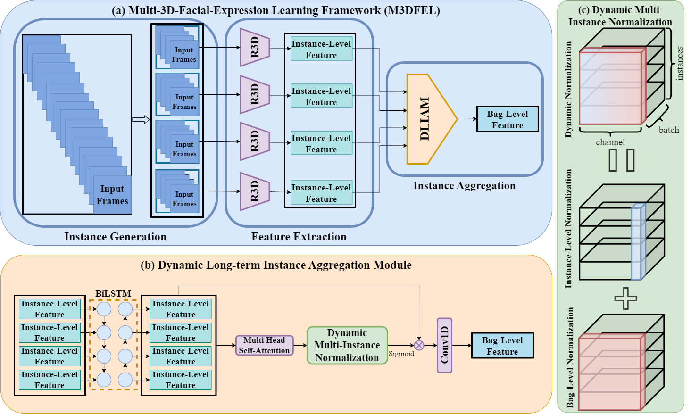
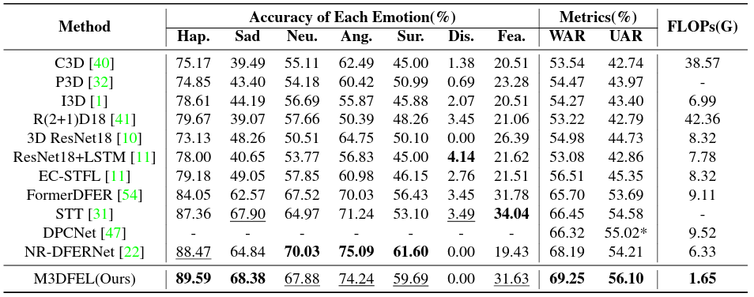

# M3DFEL
Official code for [Rethinking the Learning Paradigm for Dynamic Facial Expression Recognition](https://openaccess.thecvf.com/content/CVPR2023/papers/Wang_Rethinking_the_Learning_Paradigm_for_Dynamic_Facial_Expression_Recognition_CVPR_2023_paper.pdf) (accepted by CVPR2023). 

We propose a weakly supervised approach to model Dynamic Facial Expression Recognition (DFER) as a Multi-Instance Learning (MIL) problem. 

The Multi-3D Dynamic Facial Expression Learning (M3DFEL) framework provides a unified solution to the weakly supervised problem and model the imbalanced short- and long-term temporal relationships in DFER.



## Results on DFEW


  
## Data Preparation

Download [DFEW](https://dfew-dataset.github.io/) and unzip the files to make sure:

```
.
├── Clip
│   └── clip_224x224
│       ├── 00001
│       ├── 00002
│       └── ...
└── EmoLabel_DataSplit
    ├── test(single-labeled)
    └── train(single-labeled)
```

## Installation
```
pip install -r requirements.txt
```


## Training
```
python main.py --data_root path-to-DFEW
```

## Citation
If you find our work useful in your research, please consider citing:
```
@inproceedings{wang2023rethinking,
  title={Rethinking the Learning Paradigm for Dynamic Facial Expression Recognition},
  author={Wang, Hanyang and Li, Bo and Wu, Shuang and Shen, Siyuan and Liu, Feng and Ding, Shouhong and Zhou, Aimin},
  booktitle={Proceedings of the IEEE/CVF Conference on Computer Vision and Pattern Recognition},
  pages={17958--17968},
  year={2023}
}
```