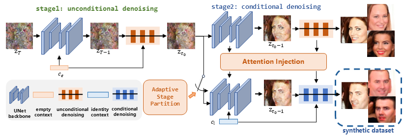

# UIFace: Unleashing Inherent Model Capability to Enhance Intra-Class Diversity in Synthetic Face Recognition



## Introduction

This repository provides the official code for UIFace. UIFace is a novel two-stage face generation method that ensures both intra-class diversity and consistency in synthesized dataset. It utilizes an empty identity context and an adaptive stage partition strategy, along with an attention injection mechanism. See details below.

### Paper Details

Xiao Lin, Yuge Huang, Jianqing Xu, Yuxi Mi, Shuigeng Zhou, Shouhong Ding. "UIFace: Unleashing Inherent Model Capability to Enhance Intra-Class Diversity in Synthetic Face Recognition". ICLR 2025.

**Abstract**

> Existing face recognition methods rely on large-scale real face datasets. However, these large datasets are collected directly from the internet, inevitably infringing on individual privacy. This paper proposes a novel framework, UIFace, which leverages the inherent capabilities of the model for diverse and consistent face image generation. During the training phase, UIFace introduces an empty identity context to learn diverse identity-irrelevant attributes. In the generation phase, UIFace employs a novel two-stage generation strategy to ensures both intra-class diversity and consistency. Furthermore, this paper explores an adaptive stage partition strategy and an attention injection mechanism which further increase the consistency and diversity. Experimental results demonstrate that UIFace achieves state-of-the-art performance using less training data and half the size of synthetic images. Moreover, as the number of synthetic faces is increased, UIFace can rival the performance of face recognition models trained on real datasets.

## Environment Settings

The code works with PyTorch 1.10.0 and Python 3.8. 

To install dependencies:

```
pip install -r requirements.txt
```

## Sampling Synthetic Face Dataset 

You can download our pretrained diffusion weights and 10k synthetic identity embeddings [here](https://drive.google.com/drive/folders/11OnYj0mtEkepjl3gE2oLeDJu_WeuB0Ma?sjid=14928657911203604045-NC) and fill in the blanks in `configs/sample_ddim_config.yaml`. Download pre-trained autoencoder weights from [stable diffusion](https://github.com/CompVis/latent-diffusion) via [this link](https://drive.google.com/drive/folders/1d-zs3yjsnzOMNkz7qy3JSb-fMf0UmSdT).

```yaml
VQEncoder_path: <latent encoder path>
VQDncoder_path: <latent decoder path>
checkpoint:
    path: <diffusion checkpoint path>

sampling:
    contexts_file: <path of synthetic identity embeddings>
    save_dir: <where to save generated images>
```

Then run 
```
torchrun --nnodes=1 --nproc_per_node 8 --master_port 12345 sample.py
```

To train face recognition model on synthetic datasets, please refer to [recognition](../../recognition/README.md).
### Generative Model Training
To train UIFace from scratch, first download [CASIA dataset](https://arxiv.org/abs/1411.7923) and fill the blanks in `configs/dataset/CASIA_file.yaml`

```yaml
dataset:
    sample_root: <your CASIA DIR>
```
Then run
 ```
torchrun --nnodes=1 --nproc_per_node 8 --master_port 12345 main.py
```

## Evaluation

Please refer to [Test](../../recognition/test/README.md).

## Acknowledgement

Our implementation is based on [IDiff-Face](https://github.com/fdbtrs/idiff-face). Special thanks to them.

## Citation

[Openreview](https://openreview.net/forum?id=riieAeQBJm&referrer=%5Bthe%20profile%20of%20Xiao%20Lin%5D(%2Fprofile%3Fid%3D~Xiao_Lin15))