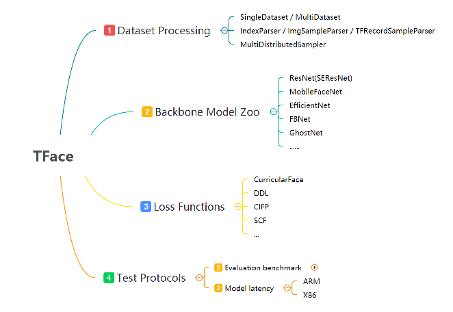

## Introduction

Face Recognition module consists of several parts: 1.datasets and samplers, 2. backbone model zoo, 3. our proposed methods for face recognition, 4. test protocols of evaluation results and model latency.

 

## Recent News
**`2021.7`**:  We released a inference example for linux_x86 based on TNN framework.

**`2021.5`**: `Federated Face Recognition`. [[paper](https://arxiv.org/abs/2105.02501)]

**`2021.3`**: `Consistent Instance False Positive Improves Fairness in Face Recognition` accepted by **CVPR2021**. [[paper](https://arxiv.org/abs/2106.05519)]

**`2021.3`**: `Spherical Confidence Learning for Face Recognition` accepted by **CVPR2021**. [[paper](https://openaccess.thecvf.com/content/CVPR2021/papers/Li_Spherical_Confidence_Learning_for_Face_Recognition_CVPR_2021_paper.pdf)]

**`2020.8`**: `Improving Face Recognition from Hard Samples via Distribution Distillation Loss` accepted by **ECCV2020**. [[paper](https://arxiv.org/abs/2002.03662)] 

**`2020.3`**: `Curricularface: adaptive curriculum learning loss for deep face recognition` has been accepted by **CVPR2020**. [[paper](https://arxiv.org/abs/2004.00288)]

## Getting Started

### Train Data

The training dataset is organized in tfrecord format for efficiency. The raw data of all face images are saved in tfrecord files, and each dataset has a corresponding index file(each line includes tfrecord_name, trecord_index offset, label). 

The `Dataset` class will parse the index file to gather image data and label for training. This form of dataset is convenient for reorganization in data cleaning(do not reproduce tfrecord, just reproduce the index file).

1. Convert raw image to tfrecords, generate a new data dir including some tfrecord files and a index_map file
``` bash
python3 tools/img2tfrecord.py --help
usage: img2tfrecord.py [-h] --img_list IMG_LIST --pts_list PTS_LIST
                       --tfrecords_name TFRECORDS_NAME

imgs to tfrecord

optional arguments:
  -h, --help            show this help message and exit
  --img_list IMG_LIST   path to the image file (default: None)
  --pts_list PTS_LIST   path to 5p list (default: None)
  --tfrecords_name TFRECORDS_NAME
                        path to the output of tfrecords dir path (default:
                        TFR-MS1M)
```

2. Convert old index file(each line includes image path, label) to new index file
``` bash
python3 tools/convert_new_index.py --help
usage: convert_new_index.py [-h] --old OLD --tfr_index TFR_INDEX --new NEW

convert training index file

optional arguments:
  -h, --help            show this help message and exit
  --old OLD             path to old training list (default: None)
  --tfr_index TFR_INDEX
                        path to tfrecord index file (default: None)
  --new NEW             path to new training list (default: None)
```

3. Decode the tfrecords to raw image
``` bash
python3 tools/decode.py --help
usage: decode.py [-h] --tfrecords_dir TFRECORDS_DIR --output_dir OUTPUT_DIR
                 --limit LIMIT

decode tfrecord

optional arguments:
  -h, --help            show this help message and exit
  --tfrecords_dir TFRECORDS_DIR
                        path to the output of tfrecords dir path (default:
                        None)
  --output_dir OUTPUT_DIR
                        path to the output of decoded imgs (default: None)
  --limit LIMIT         limit num of decoded samples (default: 10)
```

###  Train

Modified the `DATA_ROOT` and `INDEX_ROOT` in `train.yaml`, `DATA_ROOT` is the parent dir for tfrecord dir,  `INDEX_ROOT` is the parent dir for index file.

```bash
bash local_train.sh
```

### Test

Detail implementations and steps see [Test](https://github.com/Tencent/TFace/tree/master/recognition/test)

### Inference

Detail implementations see [Deploy](https://github.com/Tencent/TFace/tree/master/recognition/deploy)

## Benchmark

### Evaluation Results

|    Backbone    |      Head      |  Data  |  LFW  | CFP-FP | CPLFW | AGEDB | CALFW | IJBB (TPR@FAR=1e-4) | IJBC (TPR@FAR=1e-4) |
| :------------: | :------------: | :----: | :---: | :----: | :---: | :---: | :---: | :-----------------: | :-----------------: |
|     IR_101     |    ArcFace     | MS1Mv2 | 99.77 | 98.27  | 92.08 | 98.15 | 95.45 |        94.2         |        95.6         |
|     IR_101     | CurricularFace | MS1Mv2 | 99.80 | 98.36  | 93.13 | 98.37 | 96.05 |        94.86        |        96.15        |
|      IR_18      |    ArcFace     | MS1Mv2 | 99.65 | 94.89  | 89.80 | 97.23 | 95.60 |        90.06        |        92.39        |
|      IR_34      |    ArcFace     | MS1Mv2 | 99.80 | 97.27  | 91.75 | 98.07 | 95.97 |       92.88        | 94.65 |
|      IR_50      |    ArcFace     | MS1Mv2 | 99.80 | 97.63  | 92.50 | 97.92 | 96.05 |        93.45        |        95.16        |
| MobileFaceNet  |    ArcFace     | MS1Mv2 | 99.52 | 91.66  | 87.93 | 95.82 | 95.12 |        87.07        |        89.13        |
| GhostNet_x1.3  |    ArcFace     | MS1Mv2 | 99.65 | 94.20  | 89.87 | 96.95 | 95.58 |        89.61        |        91.96        |
| EfficientNetB0 |    ArcFace     | MS1Mv2 | 99.60 | 95.90  | 91.07 | 97.58 | 95.82 |        91.79        |        93.67        |
| EfficientNetB1 |    ArcFace     | MS1Mv2 | 99.60 | 96.39  | 91.75 | 97.65 | 95.73 |        92.43        |        94.43        |

### Backbone model size & latency

The device and platform information see below:

|         | Device                                        | Inference Framework |
| ------- | --------------------------------------------- | ------------------- |
| x86 cpu | Intel(R) Xeon(R) Platinum 8255C CPU @ 2.50GHz | [Openvino](https://docs.openvinotoolkit.org/latest/index.html)            |
| arm     | Kirin 980                                     | [TNN](https://github.com/Tencent/TNN)                 |

Test results for different backbones and different devices：

|    Backbone    | Model Size(fp32) | X86 CPU  |   ARM   |
| :------------: | :--------------: | :------: | :-----: |
| EfficientNetB0 |       16MB       | 26.29ms  | 32.09ms |
| EfficientNetB1 |       26MB       | 35.73ms  | 46.5ms  |
| MobileFaceNet  |      4.7MB       |  7.63ms  | 15.61ms |
| GhostNet_x1.3  |       16MB       | 25.70ms  | 27.58ms |
|     IR_18      |       92MB       | 57.34ms  | 94.58ms |
|     IR_34      |      131MB       | 105.58ms |   NA    |
|     IR_50      |      167MB       | 165.95ms |   NA    |
|     IR_101     |      249MB       | 215.47ms |   NA    |


## Acknowledgement
This repo is modified and adapted on these great repositories, we thank theses authors a lot for their greate efforts.
* [cavaface.pytorch](https://github.com/cavalleria/cavaface.pytorch)
* [face.evoLVe.PyTorch](https://github.com/ZhaoJ9014/face.evoLVe.PyTorch) 
* [insightface](https://github.com/deepinsight/insightface)
* [mobile-vision](https://github.com/facebookresearch/mobile-vision)

