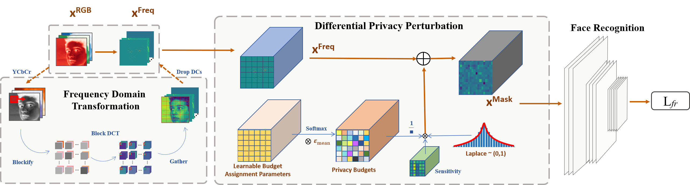
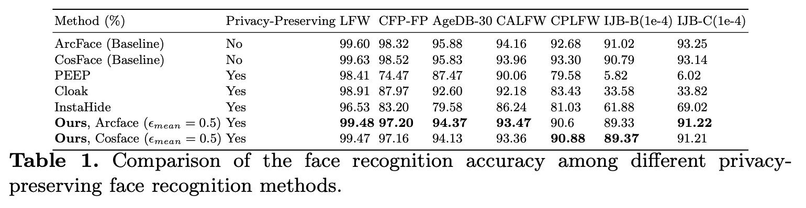
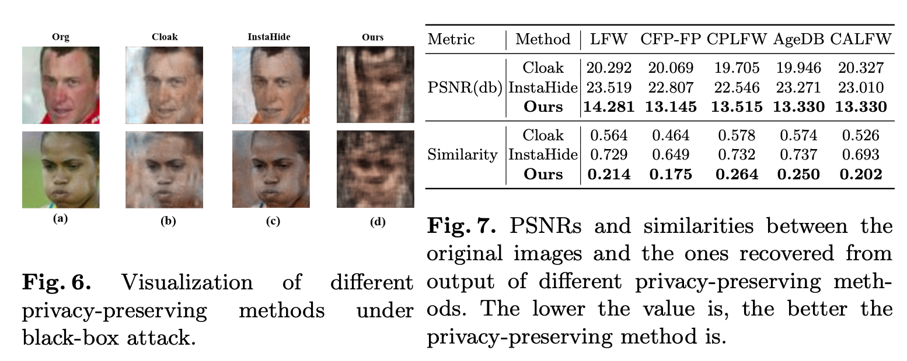
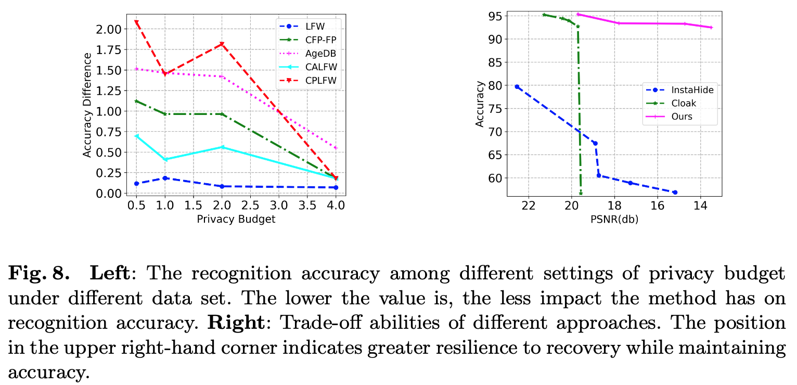

# Privacy-Preserving Face Recognition with Learnable Privacy Budgets in Frequency Domain

## Introduction

Face recognition technology has been used in many fields due to its high recognition accuracy, including the face unlocking of mobile devices, community access control systems, and city surveillance. As the current high accuracy is guaranteed by very deep network structures, facial images often need to be transmitted to third-party servers with high computational power for inference. However, facial images visually reveal the user's identity information. In this process, both untrusted service providers and malicious users can significantly increase the risk of a personal privacy breach. Current privacy-preserving approaches to face recognition are often accompanied by many side effects, such as a significant increase in inference time or a noticeable decrease in recognition accuracy. This paper proposes a privacy-preserving face recognition method using differential privacy in the frequency domain. Due to the utilization of differential privacy, it offers a guarantee of privacy in theory. Meanwhile, the loss of accuracy is very slight. This method first converts the original image to the frequency domain and removes the direct component termed DC. Then a privacy budget allocation method can be learned based on the loss of the back-end face recognition network within the differential privacy framework. Finally, it adds the corresponding noise to the frequency domain features. Our method performs very well with several classical face recognition test sets according to the extensive experiments.

## Method




## Experiments









## Citation
If you find this code useful in your research, please consider citing us:
```
@article{ji2022privacy,
  title={Privacy-Preserving Face Recognition with Learnable Privacy Budgets in Frequency Domain},
  author={Ji, Jiazhen and Wang, Huan and Huang, Yuge and Wu, Jiaxiang and Xu, Xingkun and Ding, Shouhong and Zhang, ShengChuan and Cao, Liujuan and Ji, Rongrong},
  journal={arXiv preprint arXiv:2207.07316},
  year={2022}
}
