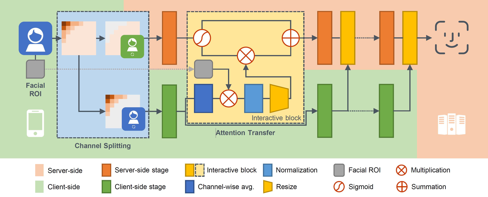

# DuetFace



## Introduction

Codes for `DuetFace: Collaborative Privacy-Preserving Face Recognition via Channel Splitting in the Frequency Domain`.

> With the wide application of face recognition systems, there is rising concern that original face images could be exposed to malicious intents and consequently cause personal privacy breaches. This paper presents DuetFace, a novel privacy-preserving face recognition method that employs collaborative inference in the frequency domain. Starting from a counterintuitive discovery that face recognition can achieve surprisingly good performance with only visually indistinguishable high-frequency channels, this method designs a credible split of frequency channels by their cruciality for visualization and operates the server-side model on non-crucial channels. However, the model degrades in its attention to facial features due to the missing visual information. 
>
> To compensate, the method introduces a plug-in interactive block to allow attention transfer from the client-side by producing a feature mask. The mask is further refined by deriving and overlaying a facial region of interest (ROI). Extensive experiments on multiple datasets validate the effectiveness of the proposed method in protecting face images from undesired visual inspection, reconstruction, and identification while maintaining high task availability and performance. Results show that the proposed method achieves a comparable recognition accuracy and computation cost to the unprotected ArcFace and outperforms the state-of-the-art privacy-preserving methods.

## Quick Starts

### Preparation

The codes work with PyTorch >= 1.7.1, with Python 3.X. To prepare the environment:

- Install the requirements.
- Overwrite the `train.py` and the `train.yaml` in the root directory with provided files.
- Fill the blanks in `train.yaml`; Namely, the data root, index root, dataset name, pre-trained checkpoint paths.
- In`torchkit/task/base_task.py`, append the `make_interactive_models()` function in the provided `base_task.py`.

### Pre-Training

To pre-train the client-side model, modify the following configurations in `train.yaml`:

```yaml
SUB_WARMUP_STEP: 24
LOAD_CKPT: false
```

To pre-train the PFLD facial landmark detector:

- Follow the instruction at its [implementation](https://github.com/polarisZhao/PFLD-pytorch), or simply download the trained checkpoint

### Training

To train a baseline RGB model, set in `train.yaml`:

```yaml
MODE: RGB
```

To train the DuetFace model, first gather your pre-trained client-side model and landmark detector, then set in `train.yaml`:

```yaml
MODE: INT                                   
SUB_WARMUP_STEP: 0                          
LOAD_CKPT: true                             
CKPT_PATH: ''                       # your checkpoint path of the pre-trained client-side model
LANDMARK_CKPT_PATH: ''              # your checkpoint path of the PFLD facial landmark detector
```

## Experimental Results

Performance of DuetFace, compared with the unprotected baseline ArcFace and SOTA privacy-preserving methods.

| Method              | PPFR    | LFW       | CFP-FP    | AgeDB     | CPLFW     | CALFW     | IJB-B(TPR@FPR) | IJB-C(TPR@FPR) |
| ------------------- | ------- | --------- | --------- | --------- | --------- | --------- | -------------- | -------------- |
| ArcFace (baseline)  | No      | 99.77     | 98.30     | 97.88     | 92.77     | 96.05     | 94.13          | 95.60          |
| ArcFace-FD          | No      | 99.78     | 98.04     | 98.10     | 92.48     | 96.03     | 94.08          | 95.64          |
| PEEP                | Yes     | 98.41     | 74.47     | 87.47     | 79.58     | 90.06     | 5.82           | 6.02           |
| Cloak               | Yes     | 98.91     | 87.97     | 92.60     | 83.43     | 92.18     | 33.58          | 33.82          |
| InstaHide           | Yes     | 96.53     | 83.20     | 79.58     | 81.03     | 86.24     | 61.88          | 69.02          |
| CPGAN               | Yes     | 98.87     | 94.61     | 96.98     | 90.43     | 94.79     | 92.67          | 94.31          |
| PPFR-FD             | Yes     | 99.68     | 95.04     | 97.37     | 90.78     | 95.72     | *              | 94.10          |
| **DuetFace (ours)** | **Yes** | **99.82** | **97.79** | **97.93** | **92.35** | **96.10** | **93.66**      | **95.30**      |

## Citation

If you find this code useful in your research, please consider citing us:

```
@inproceedings{
  title={DuetFace: Collaborative Privacy-Preserving Face Recognition via Channel Splitting in the Frequency Domain},
  author={Yuxi Mi, Yuge Huang, Jiazhen Ji, Hongquan Liu, Xingkun Xu, Shouhong Ding, Shuigeng Zhou},
  booktitle={Proceedings of the 30th ACM International Conference on Multimedia},
  year={2022}
}
```
