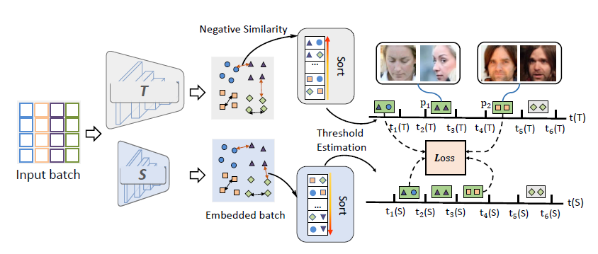
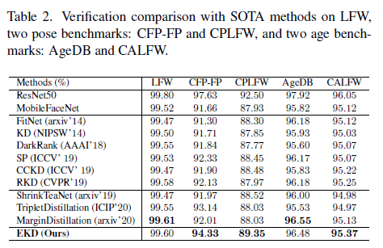
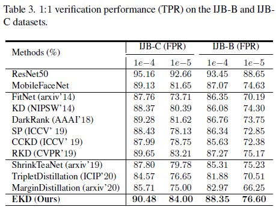
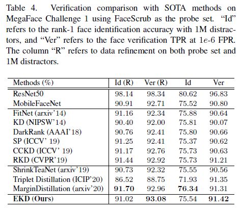

# Evaluation-oriented knowledge distillation for deep face recognition

## Introduction

Knowledge distillation (KD) is a widely-used technique that utilizes large networks to improve the performance of compact models. Previous KD approaches usually aim to guide the student to mimic the teacher’s behavior completely in the representation space. However, such one-to-one corresponding constraints may lead to inflexible knowledge transfer from the teacher to the student, especially those with low model capacities. Inspired by the ultimate goal of KD methods, we propose a novel Evaluation oriented KD method (EKD) for deep face recognition to directly reduce the performance gap between the teacher and student models during training. Specifically, we adopt the commonly used evaluation metrics in face recognition, i.e., False Positive Rate (FPR) and True Positive Rate (TPR) as the performance indicator. According to the evaluation protocol, the critical pair relations that cause the TPR and FPR difference between the teacher and student models are selected. Then, the critical relations in the student are constrained to approximate the corresponding ones in the teacher by a novel rank-based loss function, giving more flexibility to the student with low capacity. Extensive experimental results on popular benchmarks demonstrate the superiority of our EKD over state-of-the-art competitors.

## Method




## Experiments









## Citation
If you find this code useful in your research, please consider citing us:
```
@inproceedings{
  title={Evaluation-oriented knowledge distillation for deep face recognition},
  author={Yuge Huang, Jiaxiang Wu, Xingkun Xu, Shouhong Ding},
  booktitle={Proceedings of the IEEE/CVF Conference on Computer Vision and Pattern Recognition},
  year={2022}
}
```