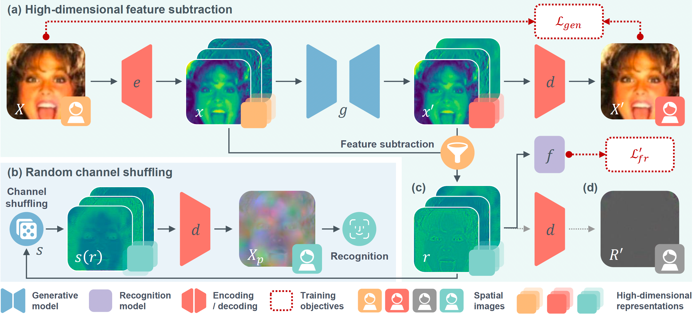

# MinusFace


Fig. 1 Pipeline of MinusFace.

## Introduction

This repository provides the official code for MinusFace. MinusFace is a novel privacy-preserving face recognition method that protects query face images during inference. It transforms the images into equal-size protective representations, specified as the subtracting and shuffled features learned by a pair of generative and recognition models. See details below.

### Paper Details

Yuxi Mi, Zhizhou Zhong, Yuge Huang, Jiazhen Ji, Jianqing Xu, Jun Wang, Shaoming Wang, Shouhong Ding, Shuigeng Zhou. "Privacy-Preserving Face Recognition Using Trainable Feature Subtraction," CVPR, 2024.

**Abstract**

> The widespread adoption of face recognition has led to increasing privacy concerns, as unauthorized access to face images can expose sensitive personal information. This paper explores face image protection against viewing and recovery attacks. Inspired by image compression, we propose creating a visually uninformative face image through feature subtraction between an original face and its model-produced regeneration. Recognizable identity features within the image are encouraged by co-training a recognition model on its high-dimensional feature representation. To enhance privacy, the high-dimensional representation is crafted through random channel shuffling, resulting in randomized recognizable images devoid of attacker-leverageable texture details. We distill our methodologies into a novel privacy-preserving face recognition method, MinusFace. Extensive experiments demonstrate its high recognition accuracy and effective privacy protection.

**Citation**

If you find this code useful in your research, please consider citing us:

```
@inproceedings{mi2024minusface,
  title={Privacy-Preserving Face Recognition Using Trainable Feature Subtraction},
  author={Mi, Yuxi and Huang, Yuge and Zhong, Zhizhou and Ji, Jiazhen and Xu, Jianqing and Wang, Jun and Wang, Shaoming and Ding, Shouhong and Zhou, Shuigeng},
  booktitle={Proceedings of the IEEE/CVF Conference on Computer Vision and Pattern Recognition},
  year={2024}
}
```

## Installation

The code works with PyTorch >= 1.7.1 and Python 3. First to install dependencies:

```
pip install -r requirements.txt
```

Download the training dataset (e.g., [BUPT-EqualizedFace](http://www.whdeng.cn/RFW/Trainingdataste.html)). [Prepare](https://github.com/Tencent/TFace/tree/master/recognition/README.md) it to match TFace's required form. Fill in the blanks in `train.yaml` with your prepared dataset's directory, index, and name:

```yaml
DATA_ROOT: '' # [To be the dataset's directory]
INDEX_ROOT: '' # [To be the index's directory]
DATASETS:
  - name: # [To be the dataset's name]
```

For MinusFace, the generative model is recommended to be trained at a slower learning rate (e.g., x0.1) than the recognition model to facilitate its convergence. To allow this, in `torchkit/hooks/learning_rate_hook.py`,  `set_optimizer_lr()` can be overwritten with the following. It is not a must.

```python
def set_optimizer_lr(optimizer, lr):
    if isinstance(optimizer, dict):
        backbone_opt, head_opts = optimizer['backbone'], optimizer['heads']
        if len(backbone_opt.param_groups) > 1: # is stage 1
            rate = 0.1
            backbone_opt.param_groups[0]['lr'] = lr * rate
            backbone_opt.param_groups[1]['lr'] = lr
            for _, head_opt in head_opts.items():
                for param_group in head_opt.param_groups:
                    param_group['lr'] = lr
        else: # is stage 2
            for param_group in backbone_opt.param_groups:
                param_group['lr'] = lr
    else:
        for param_group in optimizer.param_groups:
            param_group['lr'] = lr

```

## Training


### Training MinusFace

The generative and recognition models are first collaboratively trained to produce the recognizable high-dimensional residues, which are later shuffled and decoded to form the protective representation. To allow training that produces the residues, in `train.yaml`, set:

```yaml
TASK: stage1
NUM_DUPS: 1
```

It is recommended to distributedly train MinusFace, as the training can be resource-intensive. For local training, run `bash local_train.sh`.

### Training Recognition Model with MinusFace

We utilize the protective representations, obtained from a pre-trained MinusFace generator, to train the recognition model. In `train.yaml`, set:

```yaml
TASK: stage2
NUM_DUPS: 3 # [To be the multiplier of data augmentation]
PRETRAIN_CKPT: '' # [To be your pre-trained MinusFace checkpoint]
```

Then run `bash local_train.sh`.

## Evaluation

Please refer to [Test](../../test/README.md).