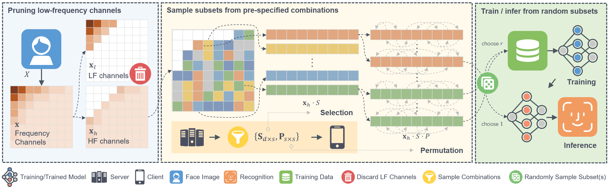

# PartialFace


Fig. 1 Pipeline of PartialFace.

## Introduction

This repository provides the official code for PartialFace. PartialFace is a privacy-preserving face recognition method that protects training and query face images. It uses discrete cosine transform (DCT) to turn images into frequency representations, then train and infer on random high-frequency components. See details below.

### Paper Details

Yuxi Mi, Yuge Huang, Jiazhen Ji, Minyi Zhao, Jiaxiang Wu, Xingkun Xu, Shouhong Ding, Shuigeng Zhou. “Privacy-Preserving Face Recognition Using Random Frequency Components,” ICCV, 2023.

**Abstract**

> The ubiquitous use of face recognition has sparked increasing privacy concerns, as unauthorized access to sensitive face images could compromise the information of individuals. This paper presents an in-depth study of the privacy protection of face images' visual information and against recovery. Drawing on the perceptual disparity between humans and models, we propose to conceal visual information by pruning human-perceivable low-frequency components. For impeding recovery, we first elucidate the seeming paradox between reducing model-exploitable information and retaining high recognition accuracy. Based on recent theoretical insights and our observation on model attention, we propose a solution to the dilemma, by advocating for the training and inference of recognition models on randomly selected frequency components. We distill our findings into a novel privacy-preserving face recognition method, PartialFace. Extensive experiments demonstrate that PartialFace effectively balances privacy protection goals and recognition accuracy. 

**Citation**

If you find this code useful in your research, please consider citing us:

```
@inproceedings{mi2023privacy,
  title={Privacy-Preserving Face Recognition Using Random Frequency Components},
  author={Mi, Yuxi and Huang, Yuge and Ji, Jiazhen and Zhao, Minyi and Wu, Jiaxiang and Xu, Xingkun and Ding, Shouhong and Zhou, Shuigeng},
  booktitle={Proceedings of the IEEE/CVF International Conference on Computer Vision},
  pages={19673--19684},
  year={2023}
}
```

## Installation

The code works with PyTorch >= 1.7.1 and Python 3. First to install dependencies:

```
pip install -r requirements.txt
```

Download and [prepare](https://github.com/Tencent/TFace/tree/master/recognition/README.md) the training dataset (e.g., [BUPT-EqualizedFace](http://www.whdeng.cn/RFW/Trainingdataste.html)). 

Fill in the blank fields in `train.yaml` to match your dataset's information.

```yaml
DATA_ROOT: '' # [To be the dataset's directory]
INDEX_ROOT: '' # [To be the index's directory]
DATASETS:
  - name: # [To be the dataset's name]
```

## Training

It is recommended to distributedly train on multiple GPUs, as the training can be resource-intensive.

For local training, run `bash local_train.sh`.

## Evaluation

Please refer to [Test](../../test/README.md).