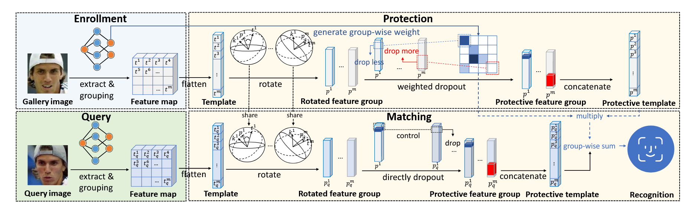

# SlerpFace
Pipeline of SlerpFacce.


## Introduction

This repository provides the official code for [SlerpFace](https://arxiv.org/pdf/2407.03043). SlerpFace rotates the face templates on the hypersphere to the vicinity of a random Gaussian distribution. It further enhances protection by performing random dropout and normalization. See details below.

### Paper Details

Zhizhou Zhong*, Yuxi Mi*, Yuge Huang†, Jianqing Xu, Guodong Mu, Shouhong Ding, Jingyun Zhang, Rizen Guo, Yunsheng Wu, Shuigeng Zhou†. "SlerpFace: Face Template Protection via Spherical Linear Interpolation", AAAI, 2025.

**Abstract**

> Contemporary face recognition systems use feature templates extracted from face images to identify persons. To enhance privacy, face template protection techniques are widely employed to conceal sensitive identity and appearance information stored in the template. This paper identifies an emerging privacy attack form utilizing diffusion models that could nullify prior protection. The attack can synthesize high-quality, identity-preserving face images from templates, revealing persons' appearance. Based on studies of the diffusion model's generative capability, this paper proposes a defense by rotating templates to a noise-like distribution. This is achieved efficiently by spherically and linearly interpolating templates on their located hypersphere. This paper further proposes to group-wisely divide and drop out templates' feature dimensions, to enhance the irreversibility of rotated templates. The proposed techniques are concretized as a novel face template protection technique, SlerpFace. Extensive experiments show that SlerpFace provides satisfactory recognition accuracy and comprehensive protection against inversion and other attack forms, superior to prior arts.

## Installation

The code works with PyTorch >= 1.7.1 and Python 3. First to install dependencies:

```
pip install -r requirements.txt
```

## Evaluation
LFW, CFP-FP, CPLFW, AgeDB, CALFW are popular verification datasets in face recognition task. Download their bin files and put them in the `./datasets` directory.

## Usage

SlerpFace consists of three main steps: feature extraction, template encryption, and template matching. Here are the detailed instructions:

### 1. Download Pre-trained Model and Pair Lists

First, download the pre-trained model and verification pair lists:

1. Download the following files from [Google Drive](https://drive.google.com/drive/folders/12O9Ql-GhlOqSAEsACcOarVDN22gss6ma):
   - Pre-trained model: `Backbone_Epoch_24_checkpoint.pth`
   - Verification pair lists:
     - `agedb_30.txt`
     - `calfw.txt`
     - `cfp_fp.txt`
     - `cplfw.txt`
     - `lfw.txt`

2. Place the downloaded files:
```bash
# Navigate to the slerpface directory
/path/to/TFace/recognition/tasks/slerpface

# Create directories
mkdir -p ckpt
mkdir -p pair_list

# Place the model file in the ckpt directory
mv Backbone_Epoch_24_checkpoint.pth ckpt/

# Place the txt files in the pair_list directory
mv agedb_30.txt calfw.txt cfp_fp.txt cplfw.txt lfw.txt pair_list/
```

### 2. Prepare Dataset

Download the verification datasets (LFW, CFP-FP, CPLFW, AgeDB, CALFW) and place their bin files in the `./datasets` directory. Make sure to update the dataset paths in the scripts according to your local setup.

### 3. Run SlerpFace Pipeline

Navigate to the TFace/recognition directory and execute the following scripts in sequence:

```bash
# Navigate to the recognition directory
cd /path/to/TFace/recognition

# 1. Feature Extraction
sh tasks/slerpface/extract_template.sh

# 2. Template Encryption
sh tasks/slerpface/encrypt_template.sh

# 3. Template Matching
sh tasks/slerpface/match_template.sh
```

Note: Please ensure you have the correct dataset paths configured in the scripts before execution.

## Results
Experimental results on different face verification datasets:

| Metric | LFW | CFP-FP | AgeDB | CALFW | CPLFW |
|--------|-----|---------|--------|--------|--------|
| Accuracy | 0.9925±0.0023 | 0.9324±0.0137 | 0.9585±0.0078 | 0.9475±0.0115 | 0.8920±0.0164 |

## Citation

If you find this code useful in your research, please consider citing us:

```
@inproceedings{mi2024minusface,
  title={SlerpFace: Face Template Protection via Spherical Linear Interpolation},
  author={Zhong, Zhizhou and Mi, Yuxi and and Huang, Yuge and Xu, Jianqing and Mu, Guodong and Ding, Shouhong and Zhang, Jingyun and Guo, Rizen and Wu, Yunsheng and Zhou, Shuigeng},
  booktitle={Proceedings of the AAAI Conference on Artificial Intelligence},
  year={2025}
}
```