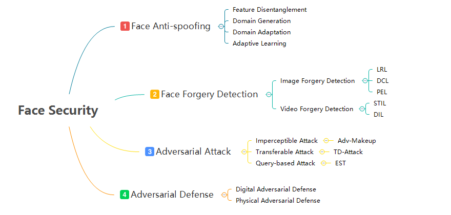

## Introduction

This module consists of several parts: 1. face anti-spoofing methods, 2. face forgery detection methods, 3. adversarial attack, 4. adversarial defense.

## Recent News

**`2023.09`**:  `Sibling-Attack: Rethinking Transferable Adversarial Attacks against Face Recognition` accepted by **CVPR2023**

**`2021.12`**:  `Dual Contrastive Learning for General Face Forgery Detection` accepted by **AAAI2022**

**`2021.12`**:  `Exploiting Fine-grained Face Forgery Clues via Progressive Enhancement Learning` accepted by **AAAI2022**

**`2021.12`**:  `Delving into the Local: Dynamic Inconsistency Learning for DeepFake Video Detection` accepted by **AAAI2022**

**`2021.12`**:  `Feature Generation and Hypothesis Verification for Reliable Face Anti-Spoofing` accepted by **AAAI2022**

**`2021.07`**: `Spatiotemporal Inconsistency Learning for DeepFake Video Detection`  accepted by **ACM MM2021**[[paper](https://arxiv.org/pdf/2109.01860.pdf)] [[Analysis](https://mp.weixin.qq.com/s/UMzXD4cpK4q9GXK76dbeww)]

**`2021.07`**: `Adaptive Normalized Representation Learning for Generalizable Face Anti-Spoofing`  accepted by **ACM MM2021**[[paper](https://arxiv.org/abs/2108.02667)]

**`2021.07`**: `Structure Destruction and Content Combination for Face Anti-Spoofing`  accepted by **IJCB2021**[[paper](https://arxiv.org/abs/2107.10628)]

**`2021.04`**: `Adv-Makeup: A New Imperceptible and Transferable Attack on Face Recognition`  accepted by **IJCAI2021**[[paper](https://www.ijcai.org/proceedings/2021/0173.pdf)] [[code](https://github.com/TencentYoutuResearch/Adv-Makeup)]

**`2021.04`**: `Dual Reweighting Domain Generalization for Face Presentation Attack Detection`  accepted by **IJCAI2021**[[paper](https://www.ijcai.org/proceedings/2021/0120.pdf)]

**`2021.03`**: `Delving into Data: Effectively Substitute Training for Black-box Attack` accepted by **CVPR2021**. [[paper](https://arxiv.org/abs/2106.05519)]

**`2020.12`**: `Generalizable Representation Learning for Mixture Domain Face Anti-Spoofing` accepted by **AAAI2021**. [[paper](https://arxiv.org/abs/2105.02453)]

**`2020.12`**: `Local Relation Learning for Face Forgery Detection` accepted by **AAAI2021**. [[paper](https://arxiv.org/abs/2105.02577)]

**`2020.06`**: `Face Anti-Spoofing via Disentangled Representation Learning` accepted by **ECCV2020**. [[paper](https://www.ecva.net/papers/eccv_2020/papers_ECCV/papers/123640630.pdf)]

## Getting Started

### FAS task

- **ANRL:** `./tasks/Face-Anti-Spoofing/ANRL`
- **DCN:** `./tasks/Face-Anti-Spoofing/DCN`

### Face forgery task

- **DCL:** `./tasks/Face-Forgery-Detection/DCL`
- **STIL:** `./tasks/Face-Forgery-Detection/STIL`

### Adversarial attack task

- **Adv-Makeup:** `./tasks/Adv-Attack-Defense/Adv-Makeup`
- **Sibling-Attack:** `./tasks/Adv-Attack-Defense/Sibling-Attack`
