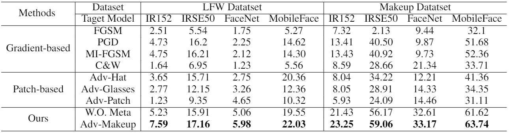

# Adv-Makeup


Adv-Makeup: A New Imperceptible and Transferable Attack on Face Recognition (IJCAI2021)

Bangjie Yin, Wenxuan Wang, Taiping Yao, Junfeng Guo, Zelun Kong, Shouhong Ding, Jilin Li and Cong Liu

*Tencent Youtu Lab*

(*Official PyTorch Implementation*)

## Update - July 13, 2021
- Release training code at Github/Tencent.

## Introduction

Deep neural networks, particularly face recognition models, have been shown to be vulnerable to both digital and physical adversarial examples. However, existing adversarial examples against face recognition systems either lack transferability to black-box models, or fail to be implemented in practice. In this paper, we propose a unified adversarial face generation method - Adv-Makeup, which can realize imperceptible and transferable attack under the black-box setting. Adv-Makeup develops a task-driven makeup generation method with the blending module to synthesize imperceptible eye shadow over the orbital region on faces. And to achieve transferability, Adv-Makeup implements a fine-grained meta-learning based adversarial attack strategy to learn more vulnerable or sensitive features from various models. Compared to existing techniques, sufficient visualization results demonstrate that Adv-Makeup is capable to generate much more imperceptible attacks under both digital and physical scenarios. Meanwhile, extensive quantitative experiments show that Adv-Makeup can significantly improve the attack success rate under black-box setting, even attacking commercial systems. In addition, our paper is accepted by the IJCAI 2021, the top artificial intelligence conference all over the world.


If you are interested in this work, please cite our [paper](https://arxiv.org/pdf/2105.03162.pdf)

    @article{yin2021adv,
      title={Adv-Makeup: A New Imperceptible and Transferable Attack on Face Recognition},
      author={Yin, Bangjie and Wang, Wenxuan and Yao, Taiping and Guo, Junfeng and Kong, Zelun and Ding, Shouhong and Li, Jilin and Liu, Cong},
      journal={arXiv preprint arXiv:2105.03162},
      year={2021}
    }


## Physical Visual Results


## Quantitative Results Compared with Other Competing Methods




## Dependencies and Installation
Dependencies and Installation:

- Python 3 (Recommend to use [Anaconda](https://www.anaconda.com/download/#linux))
- [PyTorch >= 1.0](https://pytorch.org/)
- NVIDIA GPU + [CUDA](https://developer.nvidia.com/cuda-downloads)
- Python packages: `pip install numpy opencv-python pillow skimage OmegaConf`

## Pre-trained models
- Models for face recognition, download them from [Google Drive](https://drive.google.com/drive/folders/1G_2R_7XQhzzMQdEhph0ZI7dV4sGYjjzu?usp=sharing) 
- VGG model for style loss, download it from [Google Drive](https://drive.google.com/drive/folders/1sK4flFRP7OG8dGxPdYwm5vLhJVEqfmB8?usp=sharing) 


## Training

  1. prepare training
     - Makeup and LFW dataset need to be prepared by yourself, following the setting in the [paper](https://arxiv.org/pdf/2105.03162.pdf) and the structure of the directory './datasets/Datasets_Makeup'
     - Download the face recognition and VGG models, and put them into the directory './models'
  2. train Adv-Makeup model
     - Modify the ```configs/config.yaml``` according to your own training setting
     - Run command :
       ```python3 train.py```

## Testing

Test the trained Adv-Makeup model and output the attacking success rate under different black-box model, run command :

```python3 test.py```

This will save all the generated adversarial face examples with the specific eye makeup into the dataset directory

Generate the better visual-effect adversarial face images with the post-processing Poisson blending, by going to the folder './Poisson_Image_Editing' and running command:

```python3 poisson_image_editing_makeup.py```

the results will be saved into the dataset directory

 
