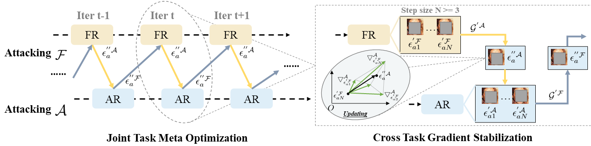
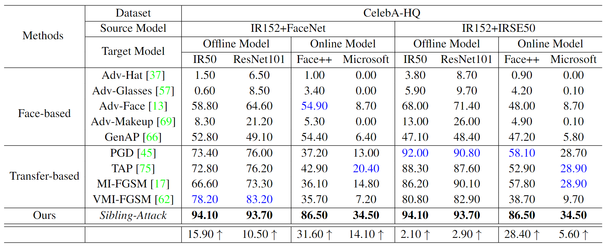
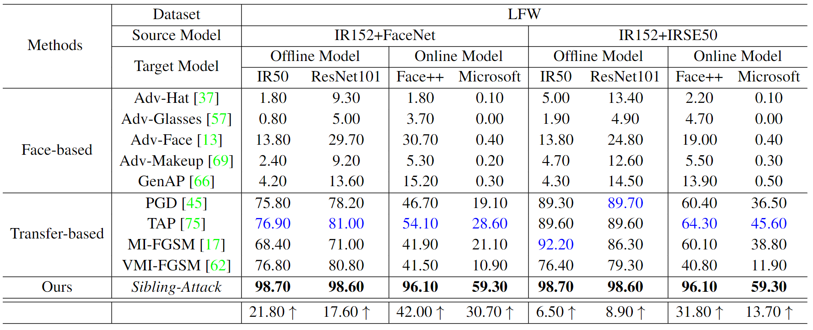
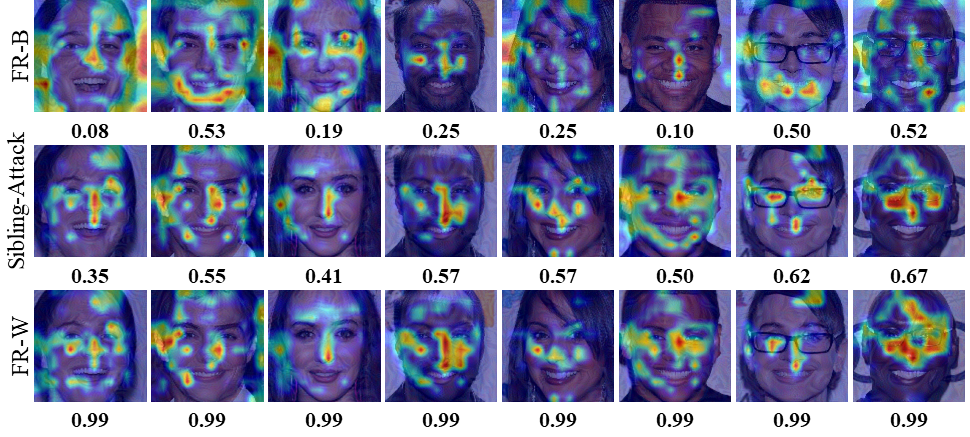

# Sibling-Attack

Sibling-Attack: Rethinking Transferable Adversarial Attacks against Face Recognition (CVPR2023)

Zexin Li, Bangjie Yin, Taiping Yao, Junfeng Guo, Shouhong Ding, Simin Chen, and Cong Liu

*Tencent Youtu Lab*

(*Official PyTorch Implementation*)

## Update - Sept. 19, 2023
- Release training code at Github/Tencent.

## Introduction

A hard challenge in developing practical face recognition (FR) attacks is due to the black-box nature of the target FR model, i.e., inaccessible gradient and parameter information to attackers. While recent research took an important step towards attacking black-box FR models through leveraging transferability, their performance is still limited, especially against online commercial FR systems that can be pessimistic (e.g., a less than 50% ASR–attack success rate on average). Motivated by this, we present SiblingAttack, a new FR attack technique for the first time explores a novel multi-task perspective (i.e., leveraging extra information from multi-correlated tasks to boost attacking transferability). Intuitively, Sibling-Attack selects a set of tasks correlated with FR and picks the Attribute Recognition (AR) task as the task used in Sibling-Attack based on theoretical and quantitative analysis. Sibling-Attack then develops an optimization framework that fuses adversarial gradient information through (1) constraining the cross-task features to be under the same space, (2) a joint-task meta optimization framework that enhances the gradient compatibility among tasks, and (3) a cross-task gradient stabilization method which mitigates the oscillation effect during attacking. Extensive experiments demonstrate that SiblingAttack outperforms state-of-the-art FR attack techniques by a non-trivial margin, boosting ASR by 12.61% and 55.77% on average on state-of-the-art pre-trained FR models and two well-known, widely used commercial FR systems.


If you are interested in this work, please cite our [paper](https://openaccess.thecvf.com/content/CVPR2023/papers/Li_Sibling-Attack_Rethinking_Transferable_Adversarial_Attacks_Against_Face_Recognition_CVPR_2023_paper.pdf)

    @inproceedings{li2023sibling,
      title={Sibling-Attack: Rethinking Transferable Adversarial Attacks against Face Recognition},
      author={Li, Zexin and Yin, Bangjie and Yao, Taiping and Guo, Junfeng and Ding, Shouhong and Chen, Simin and Liu, Cong},
      booktitle={Proceedings of the IEEE/CVF Conference on Computer Vision and Pattern Recognition},
      pages={24626--24637},
      year={2023}
    }


## The framework of Sibling-Attack



## Quantitative Results Compared with Other Competing Methods





## Visualization of black-box adversarial gradient responses



## Dependencies and Installation
Dependencies and Installation:

- Python 3 (Recommend to use [Anaconda](https://www.anaconda.com/download/#linux))
- [PyTorch >= 1.0](https://pytorch.org/)
- NVIDIA GPU + [CUDA](https://developer.nvidia.com/cuda-downloads)
- Python packages: `pip install opencv-python OmegaConf`

## Pre-trained models
- Face recognition model (```ir152.pth```), download it from [Tencent Weiyun](https://share.weiyun.com/rID4J19c).
- Attribute recognition model (```ir152_ar.pth```), download it from [Tencent Weiyun](https://share.weiyun.com/4A6OS0VS).

## Datasets
- Three datasets, including CelebA-HQ, LFW, FFHQ, donwload them from [Tencent Weiyun](https://share.weiyun.com/S8e30TLr).

## Attacking

  1. prepare attacking
     - Download the pre-trained models face recognition and attribute recognition models, and put them into the directory './models'
     - Download the three datasets and put them into the directory './datasets'
  2. perform attacks
     - Run command :
       ```python3 attack.py```

 
