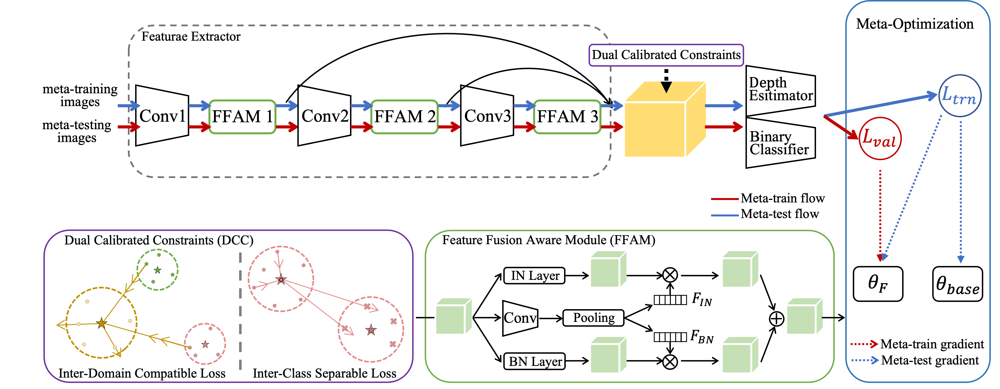
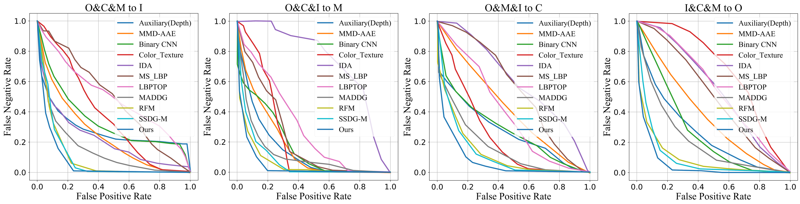
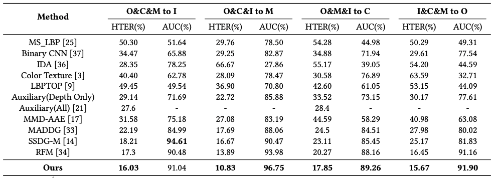
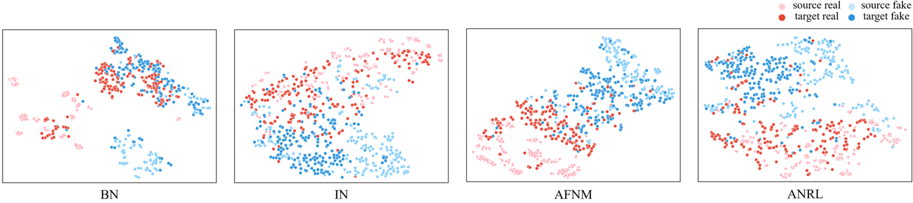

# MM2021-ANRL_FAS

<a href=https://dl.acm.org/doi/pdf/10.1145/3474085.3475279> Adaptive Normalized Representation Learning for Generalizable Face Anti-Spoofing </a> （ACM MM 2021）

Shubao Liu, Ke-Yue Zhang, Taiping Yao, Mingwei Bi, Shouhong Ding, Jilin Li, Feiyue Huang, Lizhuang Ma

Tencent Youtu Lab

(Official PyTorch Implementation)

# Abstract

With various face presentation attacks arising under unseen scenarios, face anti-spoofing (FAS) based on domain generalization (DG) has drawn growing attention due to its robustness. Most existing methods utilize DG frameworks to align the features to seek a compact and generalized feature space. However, little attention has been paid to the feature extraction process for the FAS task, especially the influence of normalization, which also has a great impact on the generalization of the learned representation. To address this issue, we propose a novel perspective of face anti-spoofing that focuses on the normalization selection in the feature extraction process. Concretely, an Adaptive Normalized Representation Learning (ANRL) framework is devised, which adaptively selects feature normalization methods according to the inputs, aiming to learn domain-agnostic and discriminative representation. Moreover, to facilitate the representation learning, Dual Calibration Constraints are designed, including Inter-Domain Compatible loss and Inter-Class Separable loss, which provide a better optimization direction for generalizable representation. Extensive experiments and visualizations are presented to demonstrate the effectiveness of our method against the SOTA competitors.

<div align="left">
  
</div>

# Quantitative Results Compared with Other Competing Methods

As shown in the table and figure, we make the following observations. (1) DG-based face anti-spoofing methods [33, 34] perform better than conventional methods [3, 36]. This proves that the distribution of the target domain is different from source domains, while the conventional methods focus on the differentiation cues that only fit source domains. (2) Our method outperforms these DG-based methods under four test settings, which demonstrates the effectiveness of ANRL.

<div align="left">
  
  
</div>

# Visualization

The t-SNE visualization of features extracted by different variants on task I&C&M to O with meta-learning. Since BN may be corrupted by domain gap and IN may lose some discriminative information, our ANRL contributes to constructing a domain-agnostic and spoofing-discriminative representation space for the best performance.

<div align="left">
  
</div>

# Dependencies and Installation

* Python 3.6 (Recommend to use Anaconda)
* Linux CUDA CuDNN
* Torch = 1.6
* Python packages: `pip install numpy opencv-python wandb easydict omegaconf timm albumentations lmdb`

# Training

To run the training file in the distributedDataParallel mode:

`sh ./train.sh GPU_NUM CONFIG_PATH PORT`

# Contributing

If you find this work useful, consider citing our work using the following BibTex:

```
@inproceedings{liu2021adaptive,
  title={Adaptive normalized representation learning for generalizable face anti-spoofing},
  author={Liu, Shubao and Zhang, Ke-Yue and Yao, Taiping and Bi, Mingwei and Ding, Shouhong and Li, Jilin and Huang, Feiyue and Ma, Lizhuang},
  booktitle={ACM International Conference on Multimedia (ACM MM)},
}
```
