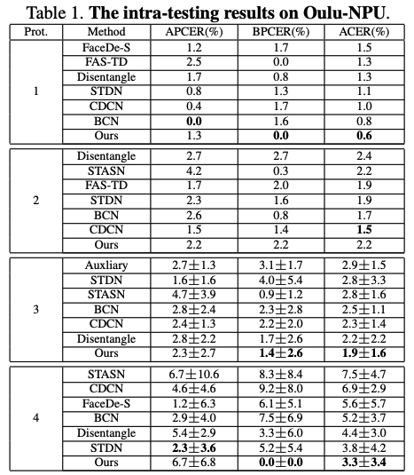
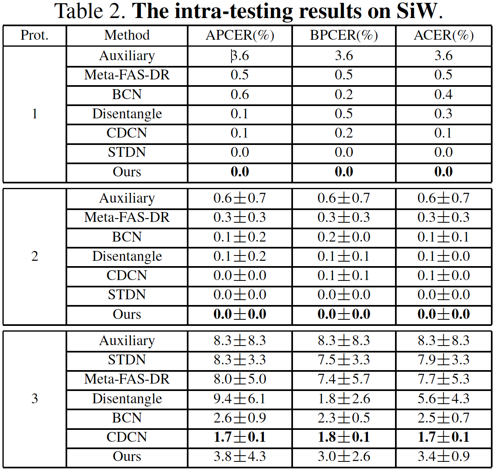
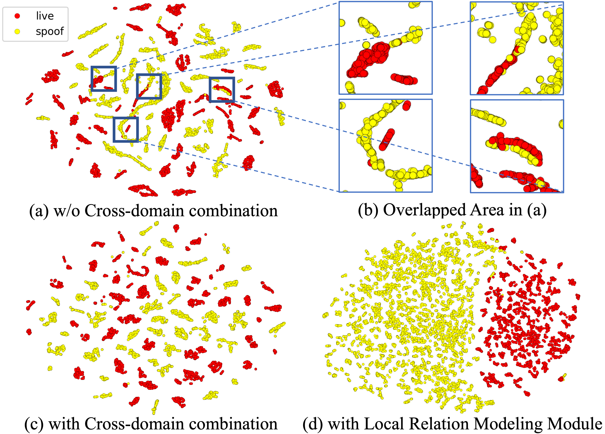

# IJCB 2021-DCN_FAS

<a href=https://arxiv.org/pdf/2107.10628.pdf> Structure Destruction and Content Combination for Face Anti-Spoofing </a>（IJCB 2021）

Ke-Yue Zhang, Taiping Yao, Jian Zhang, Shice Liu, Bangjie Yin, Shouhong Ding, Jilin Li

Tencent Youtu Lab

(Official PyTorch Implementation)

# Abstract

In pursuit of consolidating the face verification systems, prior face anti-spoofing studies excavate the hidden cues in original images to discriminate real persons and diverse attack types with the assistance of auxiliary supervision. However, limited by the following two inherent disturbances in their training process: 1) Complete facial structure in a single image. 2) Implicit subdomains in the whole dataset, these methods are prone to stick on memorization of the entire training dataset and show sensitivity to nonhomologous domain distribution. In this paper, we propose Structure Destruction Module and Content Combination Module to address these two limitations separately. The former mechanism destroys images into patches to construct a non-structural input, while the latter mechanism recombines patches from different subdomains or classes into a mixup construct. Based on this splitting-and-splicing operation, Local Relation Modeling Module is further proposed to model the second-order relationship between patches. We evaluate our method on extensive public datasets and promising experimental results to demonstrate the reliability of our method against the state-of-the-art competitors

# Quantitative Results Compared with Other Competing Methods

Tab.1 shows the comparison of our method and other methods on Oulu dataset. Our method achieves the best performance in protocols 1, 3, 4, and gets slightly worse results in protocol 2. With a simpler backbone, our method gets better results than the methods utilizing more auxiliary information or specific structure, confirming that our method has the better representative capability if all methods are of the same model capacity. Tab.2 demonstrates the results on SiW dataset. Our method performs better in protocols 1, 2 and gets comparable results in protocol 3.

<div align="left">
  
  
</div>

# Visualization

We utilize t-SNE to visualize the feature distributions from the methods trained on Replay and tested on CASIA, shown in right figure (a), (b) and (c). The features without cross-subdomain combination are overlapped between live and spoof in the blue rectangles, while the features with such combination are separated clearly. This certifies that cross-subdomain combination promotes the generalization
ability of the network across different domains.
To elucidate the effectiveness of Local Relation Modeling Module (LRMM), we display the feature distributions with/without LRMM. We further visualize the features by t-SNE in right figure (d). Compared with the features in (c), the features with LRMM are much more distinguishable. Thus, LRMM indeed aggregates the features of the same class and separates the ones of the different classes.

<div>
  
</div>

# Dependencies and Installation

* Python 3.6 (Recommend to use Anaconda)
* Linux CUDA CuDNN
* Torch = 1.7
* Python packages: `pip install numpy opencv-python wandb easydict omegaconf timm albumentations lmdb`

# Training

To run the training file in the distributedDataParallel mode:

`sh ./train.sh GPU_NUM CONFIG_PATH PORT`

# Contributing

If you find this work useful, consider citing our work using the following BibTex:

```
@inproceedings{zhang2021structure,
  title={Structure Destruction and Content Combination for Face Anti-Spoofing},
  author={Zhang, Ke-Yue and Yao, Taiping and Zhang, Jian and Liu, Shice and Yin, Bangjie and Ding, Shouhong and Li, Jilin},
  booktitle={International Joint Conference on Biometrics (IJCB)},
}
```
