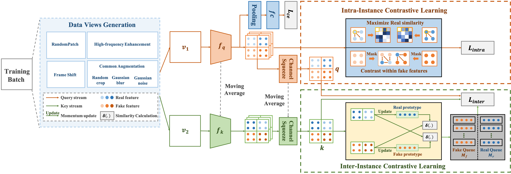

# AAAI2022 DCL

Dual Contrastive Learning for General Face Forgery Detection (AAAI2022)

Ke Sun, Taiping Yao, Shen Chen, Shouhong Ding, Jilin Li, Rongrong Ji

Tencent Youtu Lab

(Official PyTorch Implementation)

# Introduction

With various facial manipulation techniques arising, face forgery detection has drawn growing attention due to security concerns. Previous works always formulate face forgery detection as a classification problem based on cross-entropy loss, which emphasizes category-level differences rather than the essential discrepancies between real and fake faces, limiting model generalization in unseen domains. To address this issue, we propose a novel face forgery detection framework, named Dual Contrastive Learning (DCL), which specially constructs positive and negative paired data and performs designed contrastive learning at different granularities to learn generalized feature representation. Concretely, combined with the hard sample selection strategy, Inter-Instance Contrastive Learning (Inter-ICL) is first proposed to promote task-related discriminative features learning by especially constructing instance pairs. Moreover, to further explore the essential discrepancies, Intra-Instance Contrastive Learning (Intra-ICL) is introduced to focus on the local content inconsistencies prevalent in the forged faces by constructing local-region pairs inside instances. Extensive experiments and visualizations on several datasets demonstrate the generalization of our method against the state-of-the-art competitors.

If you are interested in this work, please cite our [paper](https://arxiv.org/pdf/2112.13522.pdf)

```
@article{sun2021dual,
  title={Dual Contrastive Learning for General Face Forgery Detection},
  author={Sun, Ke and Yao, Taiping and Chen, Shen and Ding, Shouhong and Ji, Rongrong and others},
  journal={arXiv preprint arXiv:2112.13522},
  year={2021}
}
```

## Dependencies and Installation

### Environment

- Python 3 (Recommend to use Anaconda)
- PyTorch >= 1.0
- NVIDIA GPU + CUDA (Need at least 15G GPU memory)

Before run the code, you should run

```shell
$ pip install -r requirements.txt
```

### Dataset

For the Faceforensics++, you should extract face using DSFD and generate the forgery masks
And change the data_root in `configs/train.yaml` as your own data_root.

## Train

- The training and testing config is written in `configs/train.yaml` and `configs/test.yaml`. Before training, you can modify the hyperparameters according to your own training setting.
- Run command:

```shell
$ python3 -m torch.distributed.launch --nproc_per_node=1 --master_port 12345  train.py -c configs/train.yaml
```

The id and model are saved in folder "wandb" automatically.

## Test

After training, you can run

```shell
$ python3 test.py --exam_id ID --dataset celeb_df&wild_deepfake
```

to evaluate your model with id on the celeb_df and wild_deepfake datasets.

Another way to test your checkpoint is to run

```shell
$ python3 test.py --ckpt_path PATH --dataset celeb_df&wild_deepfake
```
