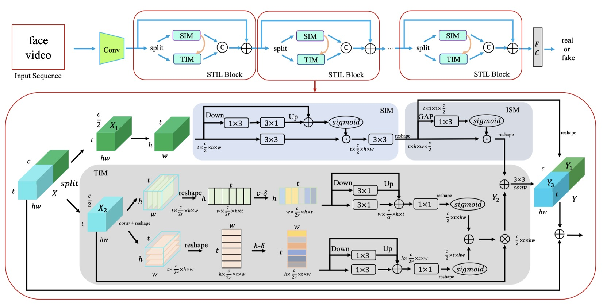

# STIL\_Deepfake Video Detection

Spatiotemporal Inconsistency Learning for DeepFake Video Detection (ACM MM 2021)

Zhihao Gu, Yang Chen, Taiping Yao, Shouhong Ding, Jilin Li, Feiyue Huang, Lizhuang Ma

*Tencent Youtu Lab*

(*Official PyTorch Implementation*)

## Introduction

The rapid development of facial manipulation techniques has aroused public concerns in recent years. Following the success of deep learning, existing methods always formulate DeepFake video detection as a binary classification problem and develop frame-based and video-based solutions. However, little attention has been paid to capturing the spatial-temporal inconsistency in forged videos. To address this issue, we term this task as a Spatial-Temporal Inconsistency Learning (STIL) process and instantiate it into a novel STIL block, which consists of a Spatial Inconsistency Module (SIM), a Temporal Inconsistency Module (TIM), and an Information Supplement Module (ISM). Specifically, we present a novel temporal modeling paradigm in TIM by exploiting the temporal difference over adjacent frames along with both horizontal and vertical directions. And the ISM simultaneously utilizes the spatial information from SIM and temporal information from TIM to establish a more comprehensive spatial-temporal representation. Moreover, our STIL block is flexible and could be plugged into existing 2D CNNs. Extensive experiments and visualizations are presented to demonstrate the effectiveness of our method against the state-of-the-art competitors.

<div  align="center">  

</div>

If you are interested in this work, please cite our [paper](https://arxiv.org/pdf/2109.01860.pdf)

```null
@article{gu2021spatiotemporal,
      title={Spatiotemporal Inconsistency Learning for DeepFake Video Detection}, 
      author={Zhihao Gu and Yang Chen and Taiping Yao and Shouhong Ding and Jilin Li and Feiyue Huang and Lizhuang Ma},
      year={2021},
      eprint={2109.01860},
      archivePrefix={arXiv},
}
```

## Dependencies and Installation

Dependencies and Installation:

* Python 3 (Recommend to use [Anaconda](https://www.anaconda.com/download/#linux))
* [PyTorch &gt;= 1.0](https://pytorch.org/)
* NVIDIA GPU + [CUDA](https://developer.nvidia.com/cuda-downloads)
* Python packages: `pip install numpy opencv-python pillow skimage scikit-learn albumentations timm easydict decord`

## Data Preparation

The codes offer complete train and test pipelines on the FF++ dataset.

For FF++ dataset, you need to prepare the following data:

* The root path containing the FF++ video dataset:

  ```
  data/ffpp_videos
  ├── manipulated_sequences
  │   ├── Deepfakes
  │   │   ├── c23
  │   │   │   └── videos
  │   │   └── c40
  │   │       └── videos
  │   ├── Face2Face
  │   │   ├── c23
  │   │   │   └── videos
  │   │   └── c40
  │   │       └── videos
  │   ├── FaceSwap
  │   │   ├── c23
  │   │   │   └── videos
  │   │   └── c40
  │   │       └── videos
  │   └── NeuralTextures
  │       ├── c23
  │       │   └── videos
  │       └── c40
  │           └── videos
  ├── original_sequences
  │   └── youtube
  │       ├── c23
  │       │   └── videos
  │       └── c40
  │           └── videos
  └── splits
      ├── test.json
      ├── train.json
      └── val.json
  ```

  Each `videos` sub-dicrectory contains the video file like `686_696.mp4` or `686.mp4`.

  The `splits` sub-dicrectory contains the official train/val/test split json file.
* data/ffpp\_face\_rects.pkl:

  We use MTCNN detector to extract face bounding boxes for each frame for each real ("youtube") video and save it in the Python dict form and store it the pickle file `ffpp_face_rects.pkl`.

  In ffpp_face_rects.pkl file, each key is the video name (without mp4 extension name), and the value is a list containing face bounding box information of each frame. To be specific, the key-value format is: video_name: `[[frame0_x0, frame0_y0, frame0_x1, frame0_y1], [frame1_x0, frame1_y0, frame1_x1, frame1_y1], ...]`. For example:

  ```
  key: 317
  value: 
   [
       [294.2803955078125, 91.37178802490234, 401.74749755859375, 225.3343048095703],
       [293.86126708984375, 90.6760482788086, 401.4103698730469, 225.52853393554688],
       [292.276123046875, 89.02545166015625, 402.7215270996094, 227.29727172851562],
       [291.4710693359375, 87.89649963378906, 402.5874328613281, 226.9261474609375]
       ...
   ]
  ```

## Train

```shell
sh train.sh
```

## Test

```shell
sh test.sh
```
