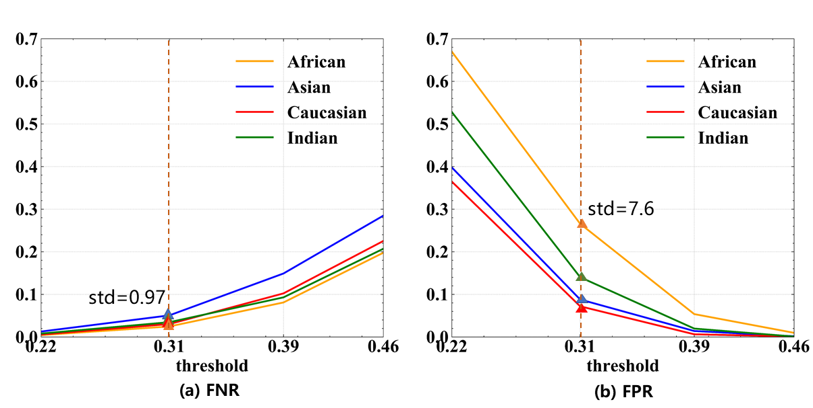
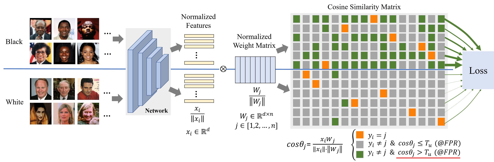
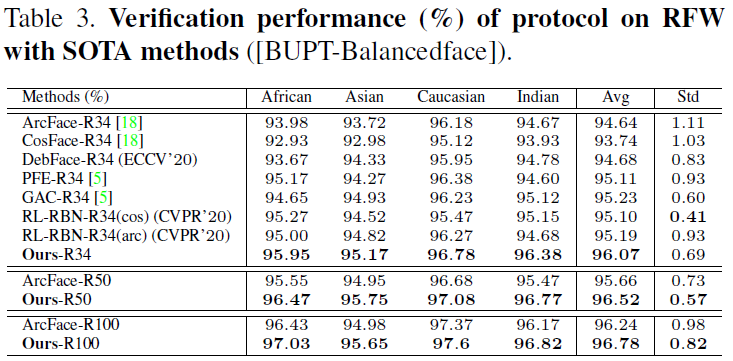
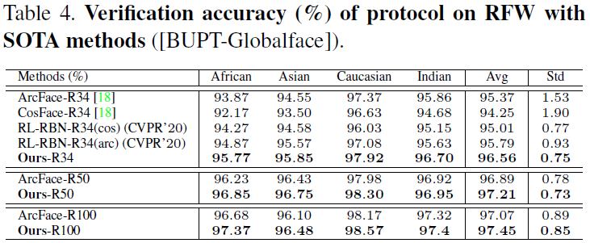

# Consistent Instance False Positive Improves Fairness in Face Recognition

## Introduction
#### 
Demographic bias is a significant challenge in practical face recognition systems. Existing methods heavily rely on accurate demographic annotations. However, such annotations are usually unavailable in real scenarios.
Moreover, these methods are typically designed for a specific demographic group and are not general enough.
In this paper, we propose a false positive rate penalty loss, which mitigates face recognition bias by increasing the consistency of instance False Positive Rate (FPR).
Specifically, we first define the instance FPR as the ratio between the number of the non-target similarities above a unified threshold and the total number of the non-target similarities. The unified threshold is estimated for a given total FPR.  Then, an additional penalty term, which is in proportion to the ratio of instance FPR overall FPR, is introduced into the denominator of the softmax-based loss. The larger the instance FPR, the larger the penalty.  By such unequal penalties, the instance FPRs are supposed to be consistent.  Compared with the previous debiasing methods, our method requires no demographic annotations. Thus, it can mitigate the bias among demographic groups divided by various attributes, and these attributes are not needed to be previously predefined during training.  Extensive experimental results on popular benchmarks demonstrate the superiority of our method over state-of-the-art competitors.



## Method


## Experiments





## Model
The IR34 pretrained model on BUPT-Balancedface can be downloaded here. 
[Baidu Cloud](link: https://pan.baidu.com/s/1PYu-yKvKsMUVfMBSEsUCEg 
passwd: vjft), 
[Google Drive](https://drive.google.com/file/d/1arwPepFwOv0C5ALYMKXU8Ahq3atMeQLD/view?usp=sharing)

## Citation
If you find this code useful in your research, please consider citing us:
```
@inproceedings{xingkunxu,
title={Consistent Instance False Positive Improves Fairness in Face Recognition},
author={Xu, Xingkun and Huang, Yuge and Shen, Pengcheng and li, Shaoxin and Li, Jilin and Huang, Feiyue},
booktitle={CVPR},
year={2021}
}
```
