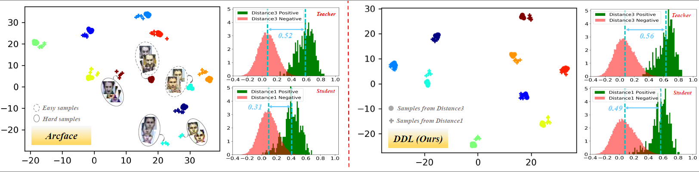
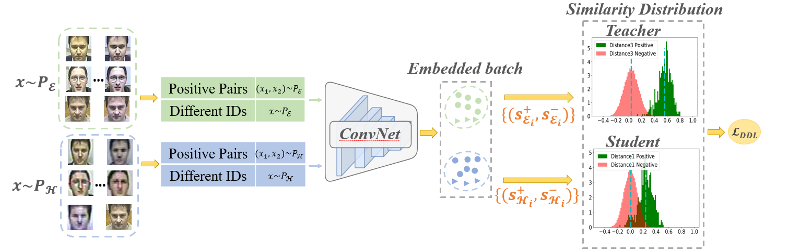
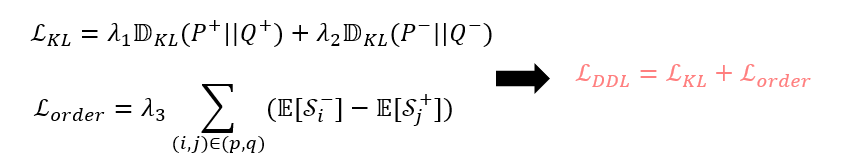
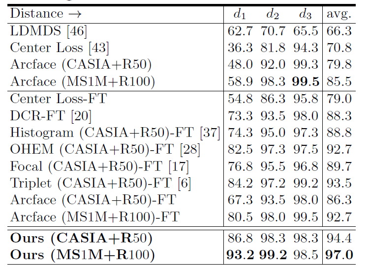
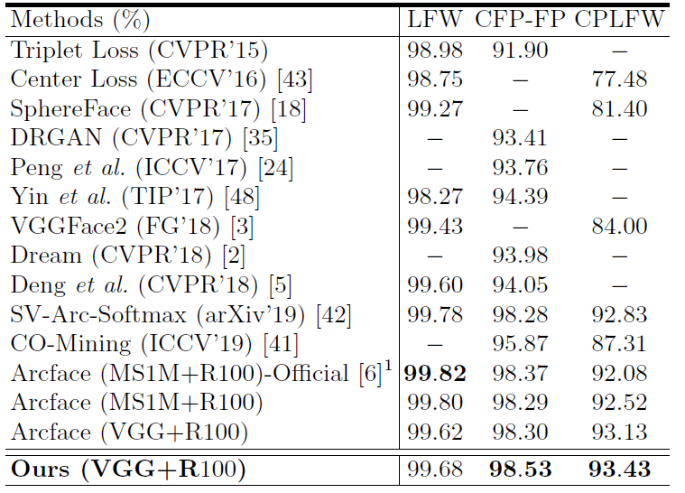
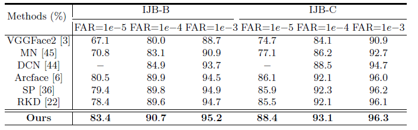

# Improving Face Recognition from Hard Samples via Distribution Distillation Loss

## Introduction
####
A primary challenge of large-scale face recognition on unconstrained imagery is to handle the diverse variations on pose, resolution, race, and illumination, etc. 
The performance of the common-used margin-based loss function degrades dramatically on hard samples, such as very large-pose and low-resolution faces. 
As illustrated in follows, the features extracted from high-resolution images (i.e., d3) by Arcface are well separated, but the features extracted from low-resolution images (i.e.,d1) cannot be well distinguished.
Our method is generic and can be applied to diverse variations to improve face recognition in hard samples.



## Method



## Experiments
#### Resolution on SCface


#### Resolution on Pose


#### Results on IJBB and IJBC


## Citation
If you find this code useful in your research, please consider citing us:
```
@inproceedings{huang2020improving,
  title={Improving face recognition from hard samples via distribution distillation loss},
  author={Huang, Yuge and Shen, Pengcheng and Tai, Ying and Li, Shaoxin and Liu, Xiaoming and Li, Jilin and Huang, Feiyue and Ji, Rongrong},
  booktitle={European Conference on Computer Vision},
  pages={138--154},
  year={2020},
  organization={Springer}
}
```

