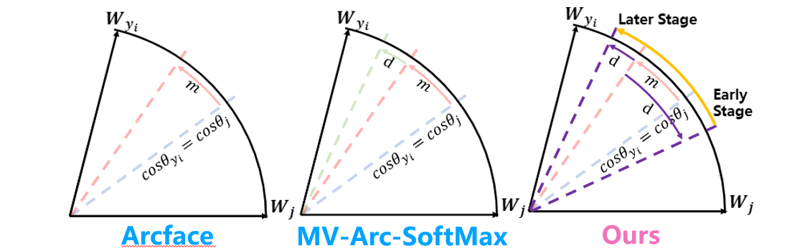
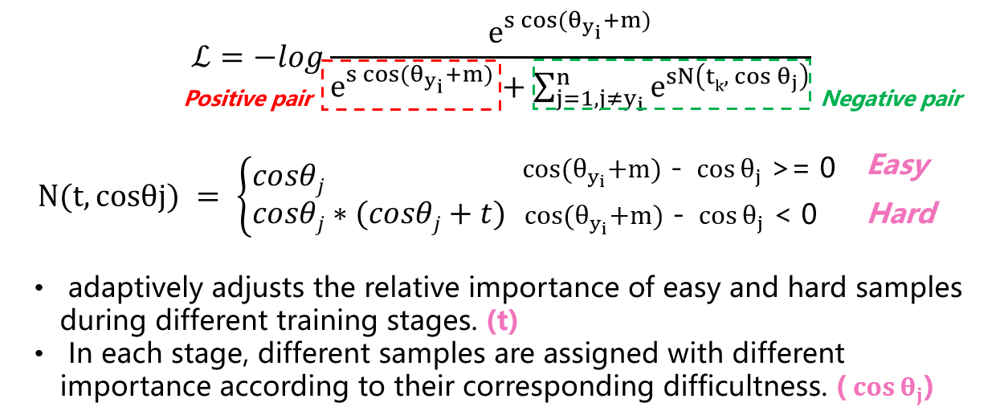
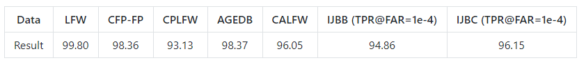

# CurricularFace: Adaptive Curriculum Learning Loss for Deep Face Recognition

## Introduction
####

The decision boundaries of common-used loss functions in face recognition are as follows.
The prior methods either do not explicitly emphasize the sample based on its importance that renders the hard samples not fully exploited; or explicitly emphasize the effects
of semi-hard/hard samples even at the early training stage that may lead to convergence issue.
The motivation of our method is to adjust the relative importance of easy and hard samples during different training stages. 
In each stage, different samples are assigned with different importance according to their corresponding difficultness.



## Method


## Experiments
The results of the released pretrained model are as follows:



The results are slightly different from the results in the paper because we replaced DataParallel with DistributedDataParallel and retrained the model.
The IR101 pretrained model can be downloaded here. 
[Baidu Cloud](link: https://pan.baidu.com/s/1bu-uocgSyFHf5pOPShhTyA 
passwd: 5qa0), 
[Google Drive](https://drive.google.com/open?id=1upOyrPzZ5OI3p6WkA5D5JFYCeiZuaPcp)

## Citation
If you find this code useful in your research, please consider citing us:
```
@article{huang2020curricularface,
	title={CurricularFace: Adaptive Curriculum Learning Loss for Deep Face Recognition},
	author={Yuge Huang and Yuhan Wang and Ying Tai and  Xiaoming Liu and Pengcheng Shen and Shaoxin Li and Jilin Li, Feiyue Huang},
	booktitle={CVPR},
	pages={1--8},
	year={2020}
}
```

