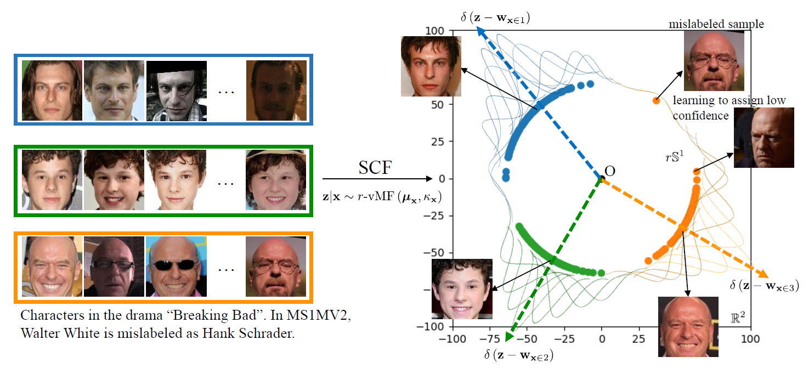
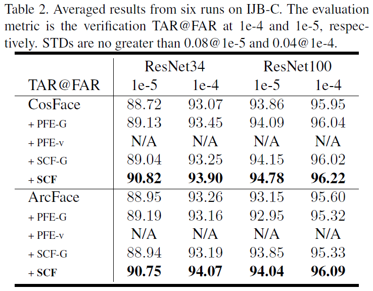
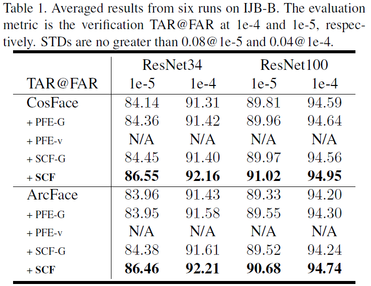

# Spherical Confidence Learning for Face Recognition

## Introduction
#### 
An emerging line of research has found that spherical spaces better match the underlying geometry of facial images, as evidenced by the state-of-the-art facial recognition methods which benefit empirically from spherical representations.Yet, these approaches rely on deterministic embeddings and hence suffer from the feature ambiguity dilemma, whereby ambiguous or noisy images are mapped into poorly learned regions of representation space, leading to inaccuracies. PFE is the first attempt to address this dilemma. However, we theoretically and empirically identify two main failures of PFE when it is applied to spherical deterministic embeddings aforementioned. To address these issues, in this paper, we propose a novel framework for face confidence learning in spherical space. Mathematically, we extend the von Mises Fisher density to its r-radius counterpart and derive a new optimization objective in closed form. We theoretically show that the proposed framework allows for better interpretability, leading to principled feature comparison and pooling. Extensive experimental results on multiple challenging benchmarks confirm our hypothesis and theory, and showcase the superior performance of our framework against prior probabilistic methods and conventional spherical deterministic embeddings both in risk-controlled recognition tasks and in face verification and identification tasks.

<p align="center">
   
</p>


## Experiments
<p align="center">
   
</p>

<p align="center">
  
</p>


## Citation
```
@inproceedings{Li2021SCF,
title={Spherical Confidence Learning for Face Recognition},
author={Shen,Li and Jianqing,Xu and Xiaqing Xu and Pengcheng Shen and Shaoxin Li and Bryan Hooi},
booktitle={CVPR},
year={2021}
}
```