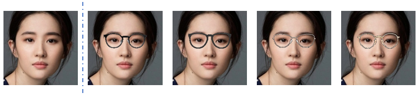
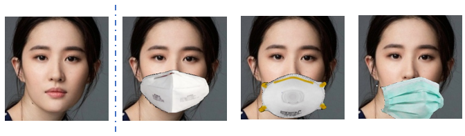
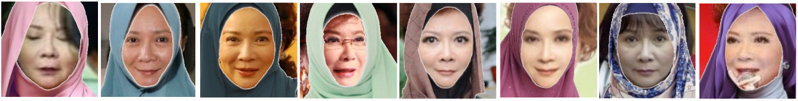

## 数据增强

### 使用方法
包含传统图片增强方法13种：
ShearXY，TranslateXY，Rotate，AutoContrast，Invert，Equalize，Solarize，Posterize，Contrast，Color，Brightness，Sharpness，Cutout。
及添加口罩、眼镜两种人脸专属的数据增强方法：
Addmask，Addglass。
使用方法为：在图片输入部分的transform中插入所需增强方法(增强概率，强度系数)
如：ShearXY(prob=0.35, mag=0.26)
    Addmask(prob=0.21, mag=0.74)

### 眼镜、口罩增强
为图片中的人脸添加眼镜，眼镜类型为从4种中随机选择一种：

  

为图片中的人脸添加口罩，利用scale系数([0,1])改变遮挡强度, 下图依次展示的是scale系数为0, 0.5, 1时的遮挡效果。口罩类型为从5种中随机选择一种：

  

### 自动戴头巾增强

使用方法为：输入图片list，对应的68点landmarklist， save_dir
为图片中的人脸添加头巾，头巾类型为随机headband中随机选择的一种类型：

  

